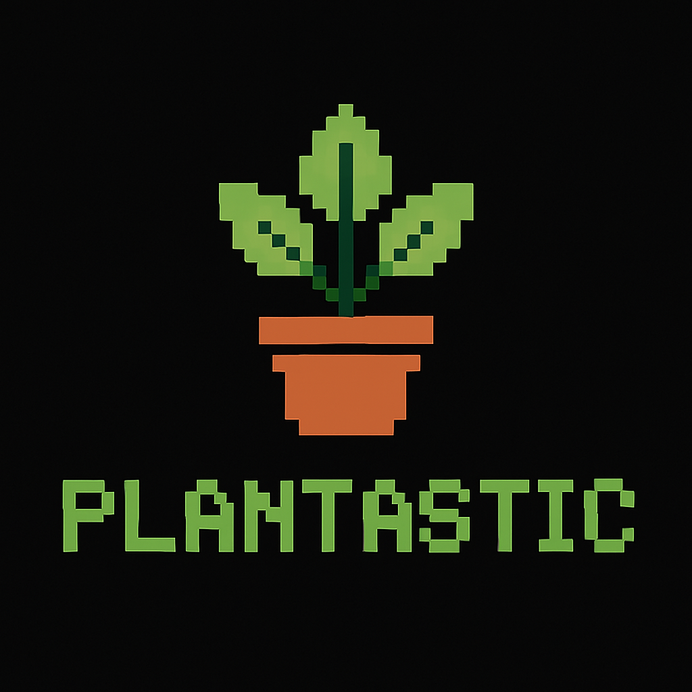

  

<h3 align="center">🌱 Plantastic</h3>

  

    Multi-interface garden management: API, CLI, and TUI.
     
    <b>Project is under active development.</b>
     
    <a href="https://github.com/yourusername/plantastic"><strong>Explore the docs »</strong></a>
     
     
    <a href="https://github.com/yourusername/plantastic">View Demo</a>
    &middot;
    <a href="https://github.com/yourusername/plantastic/issues/new?labels=bug&template=bug-report---.md">Report Bug</a>
    &middot;
    <a href="https://github.com/yourusername/plantastic/issues/new?labels=enhancement&template=feature-request---.md">Request Feature</a>
  

---

> **🚧 Plantastic is under active development. Features and interfaces may change frequently.**

---

## About The Project

**Plantastic** helps you manage your gardens, beds, plants, and tasks through:
- A RESTful API
- A Command Line Interface (CLI)
- An upcoming Text User Interface (TUI)  
  _The TUI will be available at `ssh plantastic.dev` once live._

Built with Go, Gin, and GORM, Plantastic is designed for extensibility and ease of use.

(<a href="#readme-top">back to top</a>)

---

## Features

- A minimalist application for tracking your garden

---

## Documentation

- [API Documentation](docs/API.md)  
- [CLI Usage](docs/CLI.md)  
- [TUI Info](docs/TUI.md)

---

## Roadmap

- [ ] TUI public beta

---

## License

Distributed under the MIT License. See `LICENSE` for details.